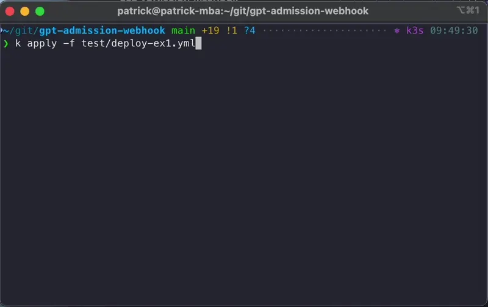

# gpt-admission-webhook
A Kubernetes admission webhook using OpenAI to arbitrarily determine if a resource should be admitted to the cluster.



# Usage
This admission webhook watches for the creation/update of Deployments, StatefulSets, and DaemonSets on a Kubernetes cluster. It then calls out to OpenAI to decide whether the resource should be admitted based on its spec.

Once installed, try deploying some workloads and test your fate!

**WARNING**: This is just for fun. Please do not deploy this in production or anywhere else you would not your workloads randomly denied from your Kubernetes cluster.

## Installation

The webhook is packaged as a Helm chart for easy deployment. The only pre-requisite is an [OpenAI API key](https://help.openai.com/en/articles/4936850-where-do-i-find-my-openai-api-key) which can be passed to the chart via the `openAI.apiKey` value.

```bash
helm install admission oci://quay.io/patrickeasters/charts/gpt-admission-webhook --version=0.1.0 --namespace gpt-webhook --create-namespace --set openAI.apiKey=xxxxxx
```

# App
The Go application itself provides only a dummy `GET /` endpoint and the admission webhook at `POST /admission`. It can be run locally or in a container if desired

## Usage
The `POST /admission` endpoint is a Kubernetes [validating admission webhook](https://kubernetes.io/docs/reference/access-authn-authz/extensible-admission-controllers/) that will call out to ChatGPT to let it arbitrarily decide whether to admit the resource to the cluster.
```
❯ http POST :3000/admission @test/request.json
HTTP/1.1 200 OK
Content-Length: 322
Content-Type: application/json
Date: Fri, 14 Jun 2024 13:03:57 GMT

{
    "apiVersion": "admission.k8s.io/v1beta1",
    "kind": "AdmissionReview",
    "response": {
        "allowed": false,
        "status": {
            "code": 403,
            "message": "This resource is not admitted because the security context is too restrictive. Let's not kill off all the fun capabilities just yet.",
            "metadata": {}
        },
        "uid": "d1751fa9-96f9-4b5f-865c-cc8ad355a273"
    }
}
```

## Build/Run
This is a small Go application shipped as a container. You can build it yourself or use my prebuilt image at `quay.io/patrickeasters/gpt-admission-webhook`.

```
> docker build -t gpt-admission-webhook .
docker run -p 3000:3000 -it gpt-admission-webhook
[+] Building 0.3s (10/10) FINISHED
...

> docker run -p 3000:3000 -it gpt-admission-webhook

   ____    __
  / __/___/ /  ___
 / _// __/ _ \/ _ \
/___/\__/_//_/\___/ v4.12.0
High performance, minimalist Go web framework
https://echo.labstack.com
____________________________________O/_______
                                    O\
⇨ http server started on [::]:3000

```
